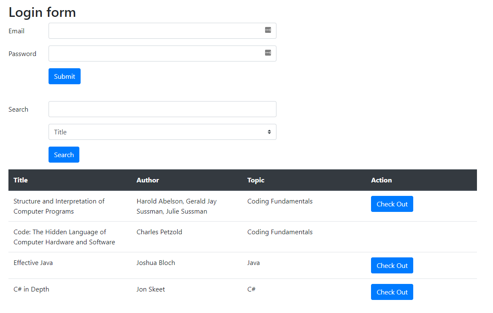

# CanaBaffle Orientation  Exam

## Getting Started

- Fork this repository under your own account
- Clone the forked repository to your computer
- Create a `.gitignore` file so generated files won't be committed
- Commit your progress frequently and with descriptive commit messages
- All your answers and solutions should go in this repository

## Keep in mind

- You can use any resource online, but **please work individually**
- **Don't just copy-paste** your answers and solutions, use your own words instead
- **Don't push your work** to GitHub until your mentor announces that the time is up

# Lending Library

Academy would like to create a programming e-book library for current students and alumni
and they need your help! Please read the app requirements & API guide below to make this goal a
reality.

## Domain Description

- Each e-book should have at least a title, author, and topic (like Spring, Java, Algorithms, etc.)
    - E-books can be checked out for 1 week at a time. They cannot be renewed.
    - E-books are not returned automatically! Users must manually return them.
    - E-books can only be checked out by 1 user at a time.
- Each user should have a email, password, and a list of the books they currently have checked out.
    - Each user can only check out 3 e-books at a time.

## Frontend

- You do not have to concern yourself with fancy styling. **Focus on functionality!**
- The **frontend** consists of **2 pages**, see the API guide below for more details.

## Database

It is up to you to define what the database model will look like, it just needs to help the backend
fulfill the outlined functionality.

The only requirements are:

- All the e-book and user data needs to be stored in a database.
- E-books and users must be stored in separate tables.
- There must be some relationship between these tables.

## Endpoints

### GET `/`



- This endpoint should show the following information:
    - A table of all e-books in the library
        - If a e-book is available, then the cell should show a button to check out that e-book.
    - A simple login form if no one is currently logged in.
        - **DO NOT IMPLEMENT SPRING SECURITY, JUST CREATE VERY SIMPLE LOGIN FUNCTIONALITY IN THE
          BACKEND.**
        - This form should also create new users if there are no existing users with the provided
          email address.
    - If someone is logged in, it should show a link to their user profile instead.
    - A search bar to search by title, author, topic, or all.

### POST `/user/login`

- It accepts all necessary data from the login form.
- If there is no user with the provided email, create a new user.
- If the login/creation is succesful, redirect to the main page.
- If the login isn't successful, redirect back to the main page with an error message that says, "
  Error: login data invalid :("

### GET `/ebook/search?keyword=java&type=title`

- This search accepts the following **case-sensitive** strings to determine which information to
  search in:
    - "title"
    - "author"
    - "topic"
    - "all"
- The search should look for e-books whose data contains the case-insensitive keyword. For example,
  a keyword of "java" should match "Learning Spring/Java" and "A book about java".
- You have two options for how this endpoint returns data (pick the one that you want to do):
    - You can redirect to "/" and show the correct list of e-books from the search.
    - You can return the main page template to show the correct list of e-books directly from this
      endpoint.

### POST `/ebook/check-out`

- This endpoint accepts all data necessary to complete the check out process.
    - Only logged-in users can successfully check out e-books!
- If the check out is successful, redirect to "/".
- If the check out isn't successful, redirect to "/" with an error message that says, "Error: e-book
  cannot be checked out, sorry."
- **Remember that only 1 person can check out an e-book at a time!!**

### GET `/user/{id}`


- This endpoint should show the following information:
    - The user's email.
    - A list of all their currently checked-out e-books in table format.
        - The due dates of the e-books should be shown in red.
- Users can return e-books on this page by clicking on the button with the word "Return" on it (see
  image above).

### POST `/ebook/return`

- This endpoint accepts all data necessary to complete the return process.
- If the return is successful, redirect to "/".
- If the return isn't successful, redirect to "/" with an error message that says, "Error: e-book
  was not returned, try again."

### GET `/user/{id}/ebooks`

- This endpoint returns a list of the e-books currently checked out by the indicated user in JSON
  format. Only include the fields shown below.
- If the provided id is invalid, return this JSON:

```json
{
    "error": "invalid id"
}
```

- Example e-book list JSON:

```json
{
    "ebooks":
    [
        {
            "title": "Clean Code: A Handbook of Agile Software Craftmanship",
            "author": "Martin, Robert C."
        },
        {
            "title": "Spring In Action",
            "author": "Walls, Craig"
        },
        {
            "title": "97 Things Every Java Programmer Should Know",
            "author": "Gee, Trisha; Henney, Kevin"
        }
    ]
}
```

### DELETE `/ebook/{id}`

- This endpoint deletes the e-book with the given id.
- If the provided id is invalid, return this JSON:

```json
{
    "error": "invalid id"
}
```

- if the deletion is successful, return this json:

```json
{
    "message": "e-book successfully deleted."
}
```

## SQL Questions

Given the following table named `sweets`
| id | name | brand | price | |:---:|:---:|:---:|:---:| | 1 | Cukorka | Dianás | 48 | | 2 | Lentilky
| Orion | 26 | | 3 | Skittles | Mars | 35 | | 4 | Oplatky | Kolonáda | 63 | | 5 | Kinder Surprise |
Ferrero | 27 | | 6 | M&Ms | Mars | 90 | | 7 | Margot | Orion | 10 |

and the following table named `reviews`
| id | rating | date | sweet_id | |:---:|:---:|:---:|:---:| | 1 | 5 | 2020-03-31 | 5 | | 2 | 4 |
2019-08-02 | 2 | | 3 | 3 | 2021-11-17 | 3 | | 4 | 5 | 2017-04-23 | 4 | | 5 | 2 | 2018-05-01 | 3 | |
6 | 4 | 2018-07-03 | 1 | | 7 | 5 | 2018-01-22 | 2 | | 8 | 5 | 2017-04-11 | 2 | | 9 | 4 | 2019-02-18
| 7 |

`1.` Write an SQL query that returns the names of sweets with reviews written before 2019.

`2.` Write an SQL query that will change all the ratings for Skittles to 1.

BONUS: Write an SQL query that returns the average price of items for each brand.
